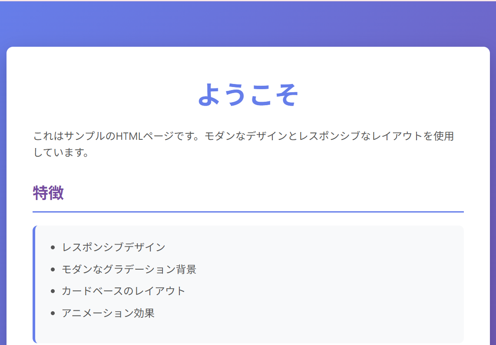

# 初めに

このプロジェクトは cursor の練習です。

## プロジェクト概要

このプロジェクトは、モダンなデザインとインタラクティブな機能を持つサンプル Web アプリケーションです。HTML、CSS、JavaScript を使用して構築されており、レスポンシブデザインに対応しています。

シンプルなカウンター機能や時刻表示機能を実装しており、Web 開発の基礎を学ぶのに適したプロジェクトです。

### 主な機能

- **カウントアップ機能**: ボタンをクリックするとカウントが増加するシンプルなカウンター
- **現在時刻表示**: ページにアクセスすると現在時刻が表示され、1 秒ごとに自動更新されます
- **モダンな UI**: グラデーション背景とカードベースのレイアウトを使用した美しいデザイン
- **インタラクティブな要素**: ボタンやリンクにホバー効果やアニメーションを実装

## 目次

- [プロジェクト概要](#プロジェクト概要)
- [使い方](#使い方)
- [画面イメージ](#画面イメージ)
- [必要要件](#必要要件)
- [技術スタック](#技術スタック)
- [関連リソース](#関連リソース)

## 使い方

### ローカルで実行する方法

1. リポジトリをクローンします：

   ```bash
   git clone https://github.com/taiju-sugahara-tocca/cursor_practice.git
   cd cursor_practice
   ```

2. `index.html` をブラウザで開きます。

   または、ファイルを直接ダブルクリックしてブラウザで開くこともできます。

### 機能の使い方

- **カウントアップ**: 「カウントアップ」ボタンをクリックすると、カウントが 1 ずつ増加します
- **時刻表示**: ページを開くと自動的に現在時刻が表示され、1 秒ごとに更新されます

## 画面イメージ



## 必要要件

- html
- javascript
